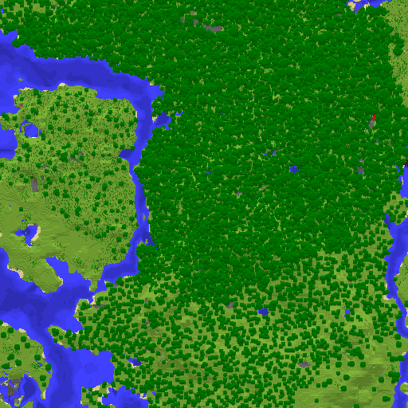

# Catlas
Catlas is a vanilla-like map renderer for Minecraft.



## Features

- [x] region rendering
- [ ] cli (Work in progress)
- [ ] Multi threading
- [ ] Web Map
- [ ] Running as a plugin

## Usage

```bash
catlas render <region-directory> --out ./out
catlas render <region-directory> --output-mode slippy --slippy-zoom 22 --out ./out
```

- `--output-mode region` (default): `<out>/<region_x>.<region_z>.gif`
- `--output-mode slippy`: region 1枚(512x512)を4分割して `<out>/<zoom>/<tile_x>/<tile_y>.gif` に出力
- `--slippy-zoom 22` のときは現実座標 `(0, 0)` に合わせるため、tile座標に `2^21` のオフセットを加算
